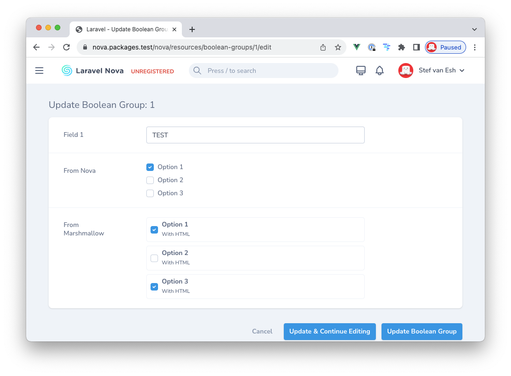
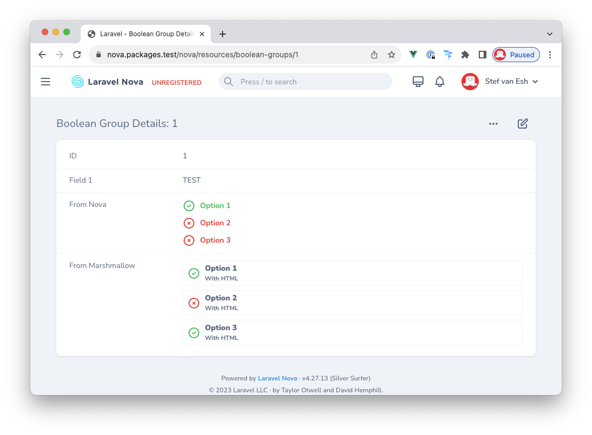
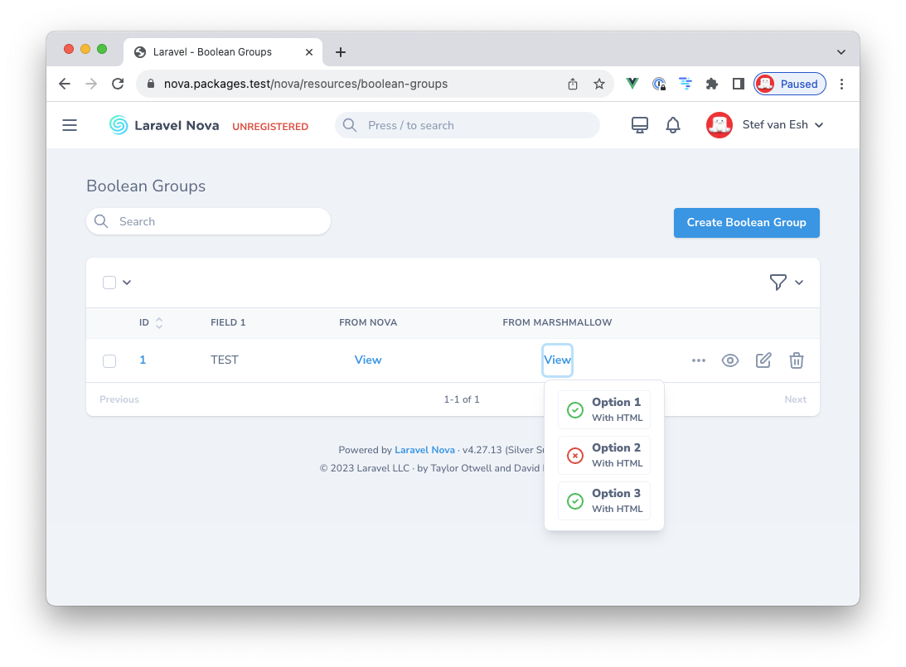

# Nova Boolean Group

This package extends the default Boolean Group field from Nova 4. This package adds the ablity to use HTML in the labels. This is handy when you have a lot of information to show in your boolean group labels.

In the example below you can see the difference in behaviour between the default Boolean Group from Nova and the Boolean Group from this package.





[](https://packagist.org/packages/marshmallow/boolean-group)
[](https://packagist.org/packages/marshmallow/boolean-group)
[](https://github.com/marshmallow-packages/boolean-group/issues)
[](https://packagist.org/packages/marshmallow/boolean-group)

## Requirements

-   PHP `^8.0`
-   Laravel Nova `^4.0` or `^5.0`

## Installation

You can install the package via composer:

```bash
composer require marshmallow/boolean-group
```

The field's service provider (`Marshmallow\BooleanGroup\FieldServiceProvider`) is auto-discovered, so no further registration is required.

## Usage

The usage of this package could not be easier. You use it as you would use the BooleanGroup from Nova. Please check there documentation for all the cool stuff you can do with this field out of the box. The only addition is, you can now add HTML in your labels. This package will do the rest. Check out the example below. This is the code we’ve use to take the screenshots above.

```php
use Marshmallow\BooleanGroup\BooleanGroup;

BooleanGroup::make(__('From Marshmallow'), 'field_3')->options([
    'option_1' => '<strong>Option 1</strong><br/><small>With HTML</small>',
    'option_2' => '<strong>Option 2</strong><br/><small>With HTML</small>',
    'option_3' => '<strong>Option 3</strong><br/><small>With HTML</small>',
]),
```

### Click area
By default, the clickable area within the border is full width. This sometimes creates an issue where users click this area without the intention to check of uncheck anything. If you want to change this behaviour, you can do so with the method below.

```php
use Marshmallow\BooleanGroup\BooleanGroup;

BooleanGroup::make(__('From Marshmallow'), 'field_3')->options([
    // ...
])->cancelFullWidth(),
```

## Changelog

Please see [CHANGELOG](CHANGELOG.md) for more information what has changed recently.

## Security

If you discover any security related issues, please email stef@marshmallow.dev instead of using the issue tracker.

## Credits

-   [Stef van Esch](https://github.com/stefvanesch)
-   [All Contributors](../../contributors)

## License

The MIT License (MIT). Please see the `license` field in [`composer.json`](composer.json) for more information.
